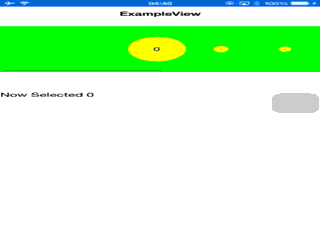

# VKEmphasizeScrollView
###A framework that can help you make a ScrollView that looks like Dock with magnification in Mac OS X.
---
##Available Interface and Method Now
	-(void)setData:(NSArray *)data;
	-(void)setEmphasizeRate:(CGFloat)EmphasizeRate;
##Available Delegate Now
	-(void)Emphasize:(EmphasizeScrollView*)EmphasizeScroll DidEmphasizeTo:(NSUInteger)index;
##Issues
###While scrollview is scrolling, the size of each cell might be wrong. But I will fix this soon.
### Method -(void)setdata:(NSArray*)data haven't worked as my expectation, I will make this work really easy.
##Preview(Current)
